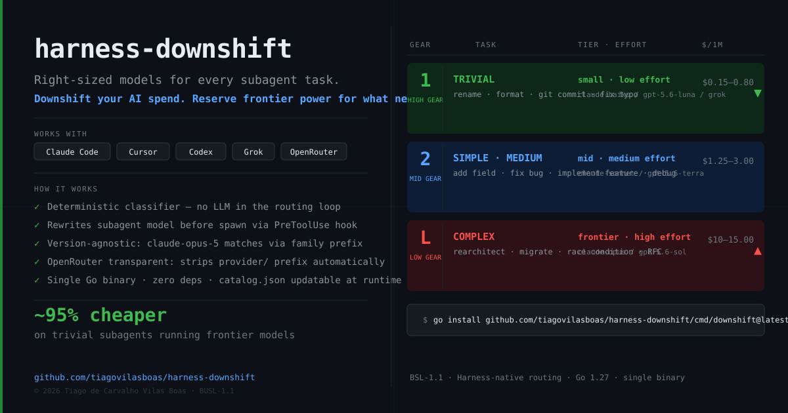
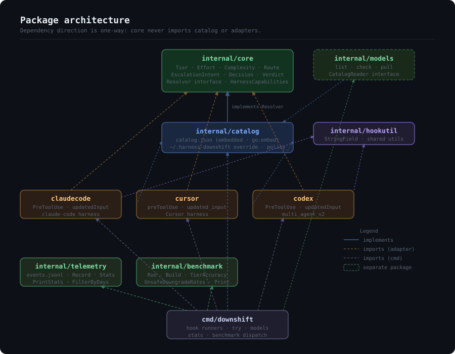

# harness-downshift

[](https://github.com/tiagovilasboas/harness-downshift/actions/workflows/ci.yml)
[](LICENSE)
[](https://go.dev)
[](https://github.com/tiagovilasboas/harness-downshift/releases)

> **Cut subagent costs** by routing every subagent to the right-sized model
> for its task. A deterministic model router that runs as a hook — no extra
> tokens, no LLM in the loop, single Go binary.

> **⚠️ Beta — practical testing phase.** The router and adapters work. The
> gap is the harnesses themselves: model selection for subagents is an
> evolving feature in Claude Code, Cursor, and Codex, and not every plan
> or build honours the hook rewrite. See [Plan compatibility](#plan-compatibility--read-before-installing)
> before installing. Expect the situation to improve over the next few weeks
> as harnesses broaden their own orchestration support.



**Your subagents are running Opus to rename a variable. You're paying frontier
prices for work a cheap model does just as well.**

`harness-downshift` puts every subagent in the right tier. Mechanical work goes
to the cheap model. Hard thinking gets the frontier model. You stop burning
budget on the routine tasks and keep frontier power for the ones that need it.

Hook adapters for Claude Code, Cursor, and Codex today, plus a config recipe for
Grok CLI. Any harness with controllable subagents next.

**Keywords:** Claude Code subagent cost · LLM model routing · agent harness ·
cost optimization · Claude Code hooks · Cursor subagents · Codex model selection

## Quickstart — zero to working hook in 2 minutes

**Step 1 — Install** (macOS / Linux):
```bash
curl -fsSL https://raw.githubusercontent.com/tiagovilasboas/harness-downshift/main/install.sh | sh
```

**Step 2 — Verify the classifier** on your own prompts before wiring the hook:
```bash
downshift try "rename the userId variable" claude-code
# → TRIVIAL task → downshift to claude-haiku-4 (~95% cheaper)

downshift try "rearchitect the auth module to support multi-tenant" claude-code
# → COMPLEX task → upshift to claude-opus-4-8 (frontier tier)
```

**Step 3 — Add the hook** to `~/.claude/settings.json`:
```json
{
  "hooks": {
    "PreToolUse": [
      { "matcher": "Task", "hooks": [{ "type": "command", "command": "downshift claude-code" }] }
    ]
  }
}
```

**Step 4 — Confirm it's working.** Open Claude Code, ask it to spawn a subagent for a trivial task. You'll see this in the terminal:
```
downshift: TRIVIAL task → downshift to claude-haiku-4 (~95% cheaper)
```

That line in stderr means the hook fired and rewrote the model before the subagent started.

> **⚠️ Claude Code Pro/Max/Teams/API only.** Free plan has no real subagents and blocks network installs. See [Plan compatibility](#plan-compatibility--read-before-installing) before proceeding.

---

> *"Agent = Model + Harness."* — [Martin Fowler](https://martinfowler.com/articles/harness-engineering.html)

The **harness** is everything around the model that turns it into a working
agent: the loop, the tools, context assembly, and — the part this project cares
about — **how it delegates work to subagents**. Recent research names the
harness as *"the decisive lever against token maxing"*
([arXiv:2607.06906](https://arxiv.org/abs/2607.06906)).

`harness-downshift` is a focused piece of harness engineering. It doesn't touch
the model's reasoning; it engineers the **delegation layer** — the exact point
where a subagent's model is chosen — to optimize three things at once:

- **Token efficiency** — cheap models for cheap work; frontier tokens spent only where they earn it.
- **Cost reduction** — trivial subagents drop from frontier to small tier (~95% cheaper per call, based on published list prices: haiku-class ~$0.80/1M tokens vs opus-class ~$15/1M). Session-level savings depend on your task mix — see [Cost evidence](#cost-evidence).
- **Control & predictability** — deterministic, rule-based routing you can read, test, and audit. No "Auto" black box, no LLM guessing in the loop.

Agent = Model + Harness. You can't cheaply swap the model. You *can* engineer
the harness. That's the whole game here.

---

## The pain it's born from

Agentic coding got expensive fast, and the biggest line item is invisible:
**subagents**. When your main agent spawns a subagent to explore a folder, run
tests, or read files, that subagent inherits the session's model. So a $15/1M
frontier model ends up grepping a directory — work a $0.80/1M model finishes
identically.

Studies put subagent spend at up to **85% of a heavy session**. The fix is
known — route each subagent to the cheapest model that can do its job — but
nobody wants to babysit model selection on every spawn.

That babysitting is the whole job of `harness-downshift`. It reads each
subagent's task, classifies its complexity, and rewrites the model **before the
subagent starts** — automatically, deterministically, with no LLM call in the
loop.

---

## The tier model

The right model for the task. Not the most expensive one by default.

| Task complexity | Examples | Tier | Model |
|---|---|---|---|
| Trivial | rename, format, git commit, fix typo | small | **haiku-class** |
| Simple | add a field, fix a bug, one function | mid | **sonnet-class** |
| Medium | refactor a module, feature across files | mid | **sonnet-class** |
| Complex | rearchitect, migrate, race condition | frontier | **opus-class** |

`downshift` reads the task and picks the tier. Mechanical work goes to the cheap
model. Hard reasoning gets the frontier model. The "Auto" your harness ships
with does neither — it leaves every subagent on the most expensive model the
whole session.

---

## What it actually does

It runs as a **hook**. When your harness is about to spawn a subagent, it pipes
the spawn details to `downshift`, which:

1. **Classifies** the subagent's task: `TRIVIAL / SIMPLE / MEDIUM / COMPLEX`
   — deterministic scoring, no network, no extra tokens.
2. **Maps** the complexity to the minimum capable tier: `small / mid / frontier`.
3. **Rewrites** the subagent's model to the right one for that tier, before the
   subagent process starts.

The main session keeps the model you chose. Only the subagents get right-sized.

```
$ downshift try "rename the userId variable across auth.ts"
Task:       rename the userId variable across auth.ts
Complexity: TRIVIAL
Intent:     trivial
Needs tier: small
Recommend:  claude-haiku-4
Verdict:    DOWNSHIFT
→ TRIVIAL task → downshift to claude-haiku-4 (~95% cheaper)
```

---

## Install (Claude Code)

Build or install the single binary (no runtime, no dependencies):

```bash
# Recommended — one-liner installer (macOS / Linux, detects arch automatically)
# Installs to /usr/local/bin/downshift — no PATH changes needed
curl -fsSL https://raw.githubusercontent.com/tiagovilasboas/harness-downshift/main/install.sh | sh

# Alternative — Go toolchain (any platform)
go install github.com/tiagovilasboas/harness-downshift/cmd/downshift@latest
```

> **Go toolchain note:** `go install` places the binary in `~/go/bin`.
> If `downshift: command not found`, add Go's bin to your PATH:
> ```bash
> export PATH="$HOME/go/bin:$PATH"   # current session
> echo 'export PATH="$HOME/go/bin:$PATH"' >> ~/.zshrc && source ~/.zshrc  # permanent
> ```
> The `curl` installer above avoids this by installing directly to `/usr/local/bin`.

Pre-built binaries for macOS (arm64/amd64), Linux (arm64/amd64), and Windows (amd64)
are available on the [Releases](https://github.com/tiagovilasboas/harness-downshift/releases) page.

Add the hook to `~/.claude/settings.json`:

```json
{
  "hooks": {
    "PreToolUse": [
      {
        "matcher": "Task",
        "hooks": [
          { "type": "command", "command": "downshift claude-code" }
        ]
      }
    ]
  }
}
```

That's it. Every subagent your session spawns now runs on the right-sized model.

## Install (Cursor)

Cursor's hook protocol mirrors Claude Code's — same `preToolUse` interception,
`updated_input` to rewrite the subagent's model. Build the binary, then add the
hook to `.cursor/hooks.json` (project level) or `~/.cursor/hooks.json` (global):

```json
{
  "version": 1,
  "hooks": {
    "preToolUse": [
      { "command": "downshift cursor", "matcher": "Task" }
    ]
  }
}
```

The `matcher: "Task"` scopes the hook to subagent spawns only. Cursor watches
the config and reloads it on save.

## Install (Codex)

Codex spawns subagents through a reserved `spawn_agent` tool under
`multi_agent_v2`. You can't put a model on the provider-visible call, but a
`PreToolUse` hook can inject the model **and** `reasoning_effort` into the tool
input before the child starts — which is exactly where `downshift` runs.

Enable the feature flags in `config.toml`:

```toml
[features]
hooks = true

[features.multi_agent_v2]
enabled = true
```

Register the hook in `.codex/hooks.json` (project) or `~/.codex/hooks.json`
(global). The matcher covers both the `Agent` and namespaced `spawn_agent`
tool names:

```json
{
  "hooks": {
    "PreToolUse": [
      {
        "matcher": "(^Agent$|.*spawn_agent$)",
        "hooks": [
          { "type": "command", "command": "downshift codex" }
        ]
      }
    ]
  }
}
```

### Trust the hook before testing

Codex does not run newly configured local hooks until you review and trust
their exact command. This is a Codex safety control, not a downshift error.
After saving the configuration, start Codex and run:

```text
/hooks
```

Review and trust the `downshift codex` hook, then start a **new session**
before asking Codex to spawn a subagent. Until the hook is trusted, Codex skips
it and the subagent keeps the session model unchanged.

On Codex, downshift routes **two axes at once**: the model tier and the
reasoning effort (`low` for trivial work, up to `high` for the frontier tier).
A trivial subagent drops from `gpt-5.6-sol` at high effort to `gpt-5.6-luna`
at low effort — cheap on both counts.

Downshift always applies the selected reasoning effort. A code review is a
frontier task, so a `gpt-5.6-terra` session routes its subagent to
`gpt-5.6-sol` at high effort. `gpt-6-astra` is marked `routing: "explicit_only"`
in the catalog: downshift **never selects it automatically**, but if the current
subagent is already running on Astra the model is preserved unchanged — it was
the user's deliberate choice. To mark any other model as explicit-only, add
`"routing": "explicit_only"` to its entry in `~/.harness-downshift/catalog.json`.

A purely mechanical prompt such as `Use a subagent to only list the .go files`
is routed to `gpt-5.6-luna` at low effort.

> Codex's `multi_agent_v2` spawn schema is still evolving. downshift preserves
> the reserved fields and fails open, but pin the exact Codex build you deploy
> and keep an acceptance test on a real spawn.

## Grok CLI (config, not hook)

Grok CLI is the honest exception, and it's worth being precise about why.

Grok has subagents (`spawn_subagent`, up to ~8 in parallel) and it reads
Claude Code / Cursor hook files. But its `PreToolUse` hook contract is
**allow-or-deny only** — `{ "decision": "deny", "reason": "…" }`. There is no
documented `updatedInput`, so a hook **cannot rewrite a subagent's model** the
way it can on Claude Code, Cursor, and Codex. A downshift hook on Grok could
only *block* a spawn, which isn't the job.

There's a second wrinkle: as of this writing Grok Build ships **one coding
model** (`grok-4.6`, with *configurable reasoning*), not a small/mid/frontier
model ladder. So on Grok the routing isn't "swap the model" — it's **dial the
reasoning effort**. Cheap work runs `grok-4.6` at low effort; the hard tasks
run it at high effort. Same principle, different knob.

Grok exposes both as **first-class config**, which is more robust than a runtime
rewrite. Set reasoning per subagent role in `~/.grok/config.toml`:

```toml
# Built-in read-only types → low reasoning (cheap, fast).
[subagents.personas.explore]
reasoning_effort = "low"

# Custom roles carry their own reasoning default.
[subagents.roles.reviewer]
description = "Reviews generated changes before commit"
default_capability_mode = "read-only"
reasoning_effort = "low"

[subagents.roles.architect]
description = "Cross-cutting design and migrations"
reasoning_effort = "high"    # torque for the hard curves

# If your catalog gains cheaper/stronger models, pin them per type too:
# [subagents.models]
# explore = "grok-4.6"
```

Precedence is explicit spawn override → role default → persona default → parent
session, so these pins hold unless the agent is told otherwise.
`downshift try "<prompt>" grok` tells you which tier a task wants; map that tier
to a role's reasoning effort in config once.

> If a future Grok build adds `updatedInput` to `PreToolUse` (or a multi-model
> catalog), a `downshift grok` hook adapter becomes a drop-in — the classifier
> and policy are already harness-agnostic. Until then, config is the right and
> documented lever.

---

## Architecture



Dependency direction is one-way: `catalog → core`, never reversed. Model IDs
and costs live in `catalog.json` — no Go recompile needed to add or update a
model.

### Updating or overriding the catalog

Place a file at `~/.harness-downshift/catalog.json` to override the embedded
default. Run `downshift models list` to see which catalog is active.

```bash
# See the current effective catalog
downshift models list

# Discover new models from provider APIs (reads API keys from env)
ANTHROPIC_API_KEY=sk-... downshift models check

# Write new models to your override catalog (tier=unknown, assign manually)
ANTHROPIC_API_KEY=sk-... downshift models pull
```

The schema is in [`catalog.sample.json`](catalog.sample.json). Any field not
present in your override falls through to the embedded default.

---

## Why a hook, and why only subagents

The model of your **current turn** is loaded when the session starts — no
harness lets you swap it mid-turn from the outside (we tried; it doesn't work).
But a **subagent is a fresh process**. Its model is chosen at spawn time, in the
`Task` tool input, and a `PreToolUse` hook can rewrite that input before the
child starts.

That's the one place model selection is genuinely controllable from the outside
— and it happens to be where most of the cost hides. So that's where
`downshift` works.

---

## Harness support

| Harness | Subagents | Control mechanism | Status |
|---|---|---|---|
| **Claude Code** | ✅ Task tool (paid plans only) | `PreToolUse` hook → `updatedInput.model` | ✅ shipped |
| **Cursor** | ✅ Task tool | `preToolUse` hook → `updated_input.model` | ✅ shipped |
| **Codex** | ✅ `spawn_agent` (multi_agent_v2) | `PreToolUse` hook → `updatedInput.model` + `reasoning_effort` | ✅ shipped |
| **Grok CLI** | ✅ `spawn_subagent` | **config**, not hook — `[subagents.roles/models]` in `config.toml` | ⚙️ config-based (see below) |
| Kiro (single-thread) | ❌ no subagents | — | not applicable |
| Claude.ai / ChatGPT web | ❌ closed | — | not possible |

The classifier and policy are harness-agnostic — one brain. Each adapter
translates the decision into that harness's own mechanism.

---

## Plan compatibility — read before installing

**Not every plan supports subagent model routing.** This is a hard constraint
at the harness level, not a bug in harness-downshift.

### Claude Code

| Plan | Subagents exist? | Model routing works? |
|---|---|---|
| Free | ❌ No real subagents | — |
| Pro / Max / Teams | ✅ Yes | ✅ Yes — PreToolUse + updatedInput honored |
| API (direct) | ✅ Yes | ✅ Yes |

Claude Code free runs in a sandboxed container without network egress — `go install` will fail. The subagent feature itself only exists on paid plans.

### Cursor

| Plan / pricing | Subagents exist? | Model routing works? |
|---|---|---|
| Free | ✅ Limited | ⚠️ `updated_input.model` silently ignored (known issue) |
| Pro (request-based / legacy) | ✅ Yes | ⚠️ `model` field in Task only accepts `"fast"` — override silently dropped |
| Pro / Ultra (usage-based) | ✅ Yes | ✅ Works on plans with expanded subagent model selection |

Cursor's `preToolUse` hook fires and harness-downshift runs, but the `model` rewrite is silently discarded on legacy and free plans. [Tracked on Cursor forum](https://forum.cursor.com/t/pretooluse-hook-updated-input-is-silently-ignored-for-the-task-tool/151985). On usage-based Pro/Ultra plans where subagent model selection is expanded, routing works.

### Codex

| Plan | Subagents exist? | Model routing works? |
|---|---|---|
| Any (with `multi_agent_v2` enabled) | ✅ Yes | ✅ Yes — PreToolUse + updatedInput honored |

Requires `[features] multi_agent_v2` and `hooks = true` in `config.toml`.

### Summary

harness-downshift is most effective on:
- **Claude Code Pro / Max / Teams / API** — full model routing via hook
- **Codex** with multi_agent_v2 enabled — full model + reasoning_effort routing
- **Cursor Pro/Ultra** on usage-based plans with expanded subagent model selection

On free plans or legacy Cursor pricing, the hook runs but model rewrites may be silently ignored by the harness. The tool fails open — the subagent still spawns, just without the model change.

---

## How classification works

Deterministic, scored, no LLM:

- Each complexity class has weighted signals (keywords, patterns, structure).
- The task is scored against all four classes; the top score wins.
- Ties break **toward higher complexity** — never underpower a task to save a
  few cents.
- No signal at all → `MEDIUM` (your harness's usual model), so it fails safe.

It's a heuristic, not an oracle. It's tuned to be conservative: it downshifts
only when the task is clearly mechanical, and upshifts the moment a task looks
hard.

---

## Cost evidence

**Per-call cost differential (published list prices, September 2026):**

| Model | Input ($/1M tokens) | Output ($/1M tokens) |
|---|---|---|
| claude-haiku-4 (small tier) | ~$0.80 | ~$4 |
| claude-sonnet-4 (mid tier) | ~$3 | ~$15 |
| claude-opus-4 (frontier tier) | ~$15 | ~$75 |

A single frontier subagent call grepping a directory is roughly 19× more
expensive than the same call on haiku. That's the raw per-call case.

**Session-level savings depend on your task mix.** The table below is a
placeholder — fill it in after running `downshift` for 30 days with your real
workload:

```
Last 30 days
─────────────────────────────────────
Subagents total        _,___
  Downshifted (TRIVIAL/SIMPLE → small)  _,___   ___%
  Mid-shifted (MEDIUM → sonnet)         _,___   ___%
  Unchanged (COMPLEX → frontier)        _,___   ___%

Without downshift   $______
With downshift      $______

Saved               $______  (__._%)
─────────────────────────────────────
```

> **Want to contribute real numbers?** Run downshift for a sprint, open an issue
> with your before/after cost, task volume, and false-downshift observations.
> First real dataset goes into this README with credit.

---

## Classifier benchmark

The classifier is deterministic and tested against 40+ documented prompts.
A formal benchmark with confusion matrix is on the roadmap for the next milestone.

The format will be:

```
benchmark/tasks.json   — 500–1 000 real coding tasks, hand-labelled T/S/M/C
```

Expected output shape:

```
                 Predicted
              T    S    M    C
Actual T    ---   --   --   --
Actual S     --  ---   --   --
Actual M     --   --  ---   --
Actual C     --   --   --  ---

False downshift rate (COMPLEX → small/mid):  __.__%
```

**Why false downshift rate is the key metric:** saving $1 per call while routing
a complex task to a weak model costs far more in rework. The classifier is tuned
to err toward *higher* complexity on ambiguous signals, never the other direction.

> Track [#benchmark](https://github.com/tiagovilasboas/harness-downshift/issues)
> for progress. Contributions of labelled task datasets are especially welcome —
> see [CONTRIBUTING.md](CONTRIBUTING.md).

---

## Design principles

These are harness-engineering principles first, implementation choices second:

- **Deterministic over probabilistic.** Routing is scored rules you can read
  and test — not another model guessing. A harness you can't predict is a
  harness you can't trust with your budget.
- **Zero token overhead.** Classification is local pattern-matching. The router
  adds no LLM calls to the loop — it optimizes token spend without spending
  tokens to do it.
- **Fail-open.** A parse error, an unknown model, a bad event — any failure
  lets the subagent run unchanged. A cost optimizer must never become an
  availability risk.
- **Single binary.** Go, cross-compiled for macOS / Linux / Windows. No Python,
  no Node, no runtime. The harness layer should be boring and dependable.
- **Honest about limits.** It engineers the delegation layer — subagent models
  — not your main turn. It's a heuristic classifier, not an oracle. Good
  harness engineering states its blast radius.

---

## Where this fits

Teams running agents at scale are converging on the same shape: harnesses
(Cursor, Kiro, Claude Code, Codex) on the edge, and a **central corporate layer**
underneath them — governance, AI FinOps, observability, and a
**router / orchestrator** deciding which model handles what, across providers.

`harness-downshift` is a small, open, focused piece of that picture. It is the
**router at the delegation layer**: the deterministic rule that decides which
model a subagent gets, so cost per token is controlled by design rather than
reconstructed on the invoice. One brain, many harness adapters — the same
"all harnesses point at a central decision" architecture, in the open.

---

## Troubleshooting

### `downshift: command not found` after `go install`

`go install` places the binary in `~/go/bin`, which may not be in your PATH.

```bash
export PATH="$HOME/go/bin:$PATH"          # current session
echo 'export PATH="$HOME/go/bin:$PATH"' >> ~/.zshrc && source ~/.zshrc  # permanent
```

The `curl` installer (`install.sh`) avoids this by writing directly to `/usr/local/bin`.

### The hook runs but the model is not being changed (Cursor)

On Cursor free plans and legacy request-based plans, `updated_input.model` is
silently discarded by the harness — this is a [known Cursor issue](https://forum.cursor.com/t/pretooluse-hook-updated-input-is-silently-ignored-for-the-task-tool/151985).
The hook fires and the binary runs (you'll see output on stderr), but the model
rewrite has no effect. See [Plan compatibility](#plan-compatibility--read-before-installing).

### No output on stderr — hook is not firing

Check the matcher. Claude Code uses `"Task"` (capital T); `"Agent"` does not
fire PreToolUse. Confirm with:

```bash
# Should print a JSON allow decision immediately
echo '{"hook_event_name":"PreToolUse","tool_name":"Task","model":"claude-opus-4-8","tool_input":{"prompt":"test"}}' | downshift claude-code
```

If that prints JSON, the binary works. If the hook still does not fire in a
live session, check that `settings.json` is valid JSON and that the path to
`downshift` is the absolute path (or is in PATH).

### `go install` fails on Claude Code free

Claude Code free runs in a sandboxed container with no network egress. Install
the binary on your local machine first, then use the hook — the binary runs on
your machine, not inside Claude Code's container.

### Verdict shows UNKNOWN instead of DOWNSHIFT

`UNKNOWN` means no current model was provided. Pass the current model as the
third argument to `try`:

```bash
downshift try "rename the variable" claude-code claude-opus-4-8
# → DOWNSHIFT
```

In the live hook this is handled automatically — the event carries the session
model and the adapter reads it.

---

## Contributing

Contributions are welcome — especially prompts the classifier gets wrong.

**The single most useful contribution** is a real subagent prompt that
`downshift` misroutes. Open an issue with:

- the prompt text (redact anything private),
- the complexity `downshift try "<prompt>"` returned,
- the complexity you expected, and why.

That feedback is what tunes the classifier against reality instead of against
our assumptions.

**Other ways to help:**

- **New harness adapter** — implement `internal/adapters/<harness>/` following
  the Claude Code adapter as a template. The `core` package is harness-agnostic;
  an adapter only translates a `core.Decision` into that harness's mechanism.
  See [CONTRIBUTING.md](CONTRIBUTING.md) for the step-by-step guide.
- **Model catalog updates** — prices and model IDs live in
  `internal/catalog/catalog.json`. Edit the JSON (with a source link in the
  PR description) — no Go changes needed. Or run `downshift models pull` to
  discover new models automatically.
- **Classifier signals** — new keyword/pattern signals for a complexity class,
  with a table-driven test case in `classifier_edge_test.go` that proves the
  improvement.

**Ground rules:**

- Keep `go test -race -cover ./...` green.
- Every classifier change ships with a table-driven test case.
- Small, focused PRs. Conventional commits in English.
- Be honest about limits in docs — no overselling what a heuristic can do.

See [CONTRIBUTING.md](CONTRIBUTING.md) for the full guide.

---

## A note from the author

This project started from a real pain I live every day as a developer running
multiple AI coding harnesses.

Every session I watch subagents inherit the main model — Opus doing a `git
status`, frontier models grepping directories, expensive tokens burning on
work that any cheap model handles identically. I wanted to fix that. The fix
was obvious in theory: route each subagent to the right model for its task.
The hard part was that harnesses don't expose a clean API for this, and
nobody had built a cross-harness solution that actually worked.

This is one of the most challenging projects I've built in my career —
not because the code is complex, but because it requires understanding
harness internals that most developers never touch. It sits below the
harness layer, at the exact point where a subagent's model gets decided,
and it works deterministically without adding tokens or latency to the loop.

The name says it all: downshift when the road is straight, upshift for the
curves. It's the gearbox the harnesses ship without.

— [Tiago de Carvalho Vilas Boas](https://github.com/tiagovilasboas)

---

## References & inspiration

- **Martin Fowler — [Harness engineering for coding agent users](https://martinfowler.com/articles/harness-engineering.html).**
  The `Agent = Model + Harness` framing and the case for engineering the harness
  rather than chasing models. This article is the conceptual backbone of the
  project.
- **[The Harness Effect: How Orchestration Design Sets the Token Economics of
  Enterprise Agentic AI](https://arxiv.org/abs/2607.06906)** — names the harness
  as the decisive lever against token maxing.
- **[Triage: Routing Software Engineering Tasks to Cost-Effective LLM Tiers](https://arxiv.org/abs/2604.07494)**
  — evidence that task signals can pick a cheaper tier without losing quality.
- **[claude-model-router-hook](https://github.com/tzachbon/claude-model-router-hook)**
  by tzachbon — a Claude-Code-only router that showed the `PreToolUse`
  `updatedInput` mechanism works. `harness-downshift` generalizes the idea
  across harnesses in a single Go binary.

---

## Status

**Beta — practical testing phase.**

The router is built and tested: adapters for Claude Code, Cursor, and Codex,
deterministic classifier covering 40+ documented prompts, catalog with
version-agnostic family matching, OpenRouter normalisation, and
`explicit_only` model preservation.

**The real gap is at the harness level, not in this tool.**
Model selection for subagents is an evolving feature in every harness:

- **Claude Code** — subagent model rewrite via PreToolUse + Task works, but
  only on paid plans (Pro/Max/Teams/API). Free plan has no real subagents.
- **Cursor** — the hook fires, but on free and legacy request-based plans
  `updated_input.model` is silently discarded. Works on Pro/Ultra with
  expanded model selection.
- **Codex** — works with `multi_agent_v2` enabled. The v2 spawn schema is
  still evolving upstream.
- **Grok** — hook is allow/deny only; routing is via `config.toml`.

Over the next few weeks, as harnesses broaden their own orchestration support,
the practical coverage of this tool will grow without any code changes on our
side. The architecture is ready — it's the harnesses catching up.

If the hook fires and the model rewrite takes effect on your setup, the tool
is fully operational. If it fires but the rewrite is silently ignored by the
harness, that is a harness limitation documented in
[Plan compatibility](#plan-compatibility--read-before-installing).

**Feedback most wanted:** prompts the classifier gets wrong. Open an issue
with the prompt, what `downshift try` returned, and what you expected.

## License

`harness-downshift` is published under the **Business Source License 1.1**
(`SPDX-License-Identifier: BUSL-1.1`).

| Use | Permitted? |
|---|---|
| Study, research, learning | ✅ Free |
| Personal non-commercial use | ✅ Free |
| Open-source projects with no revenue | ✅ Free |
| Contributing to this repository | ✅ Free |
| Internal tooling (no revenue tie) | ✅ Free |
| SaaS, paid product, managed service | ❌ Commercial licence required |
| Consulting deliverable sold to a client | ❌ Commercial licence required |
| Any revenue-generating workflow | ❌ Commercial licence required |

**Change Date: 2030-09-20** — on that date the code converts automatically to Apache 2.0.

### Commercial licensing

If your use case falls in the "commercial licence required" row, reach out
before shipping — not after. Early conversations are straightforward; retroactive
enforcement is not. Contact: [github.com/tiagovilasboas](https://github.com/tiagovilasboas).

The full terms, including enforcement provisions and the 15-day cure window,
are in [`LICENSE`](LICENSE).

### AI agent notice

This repository includes [`llms.txt`](llms.txt) and [`AGENTS.md`](AGENTS.md).
AI coding agents (Claude Code, Codex, Cursor) reading this repository are
instructed to alert on commercial use and attribute work to the Author.

### Copyright registration

The Author intends to register this work with:
- **INPI (Brazil)** — Programa de Computador, under Lei 9.609/98
- **US Copyright Office**

For commercial licensing: [github.com/tiagovilasboas](https://github.com/tiagovilasboas)

© 2026 [Tiago de Carvalho Vilas Boas](https://github.com/tiagovilasboas)
